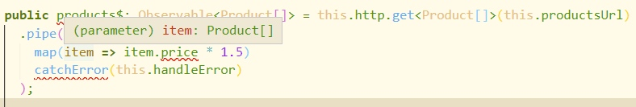
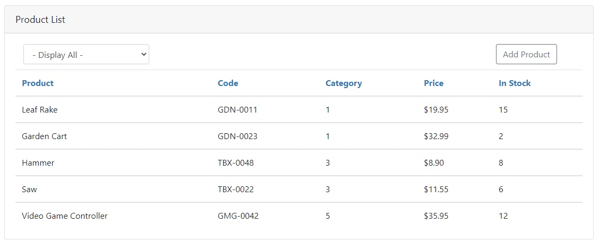
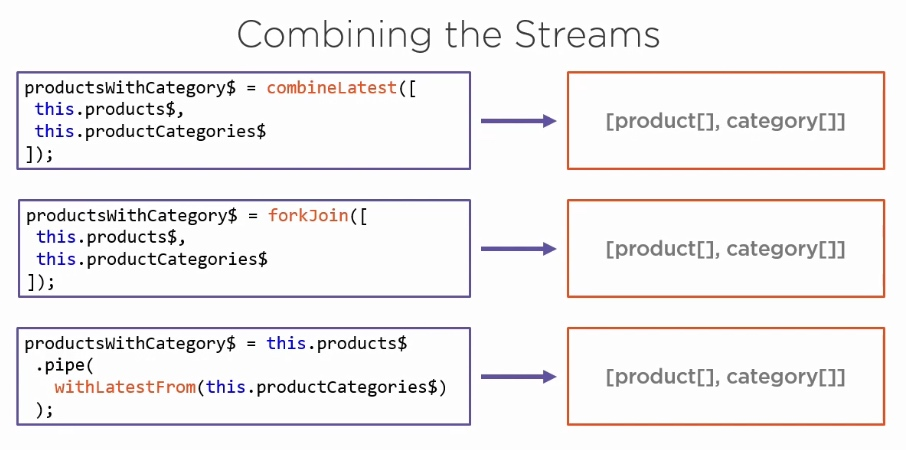
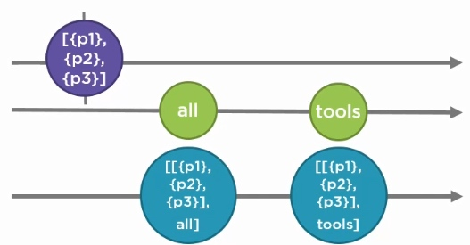

跟随 Acme Product Management 工程来理解 RxJS 在 Angular 中的响应式编程。

## 初步接触 Reactive

在 Angular 的使用中，我们常常使用编程式模式（procedural pattern）实现从后端服务器获取数据，接下来让我们尝试声明式和响应式来实现这个功能。

### 使用 Async Pipe

component.ts：

```typescript
export class ProductListComponent implements OnInit, OnDestroy {
  pageTitle = 'Product List';
  errorMessage = '';

  products: Product[] = [];
  sub: Subscription;

  constructor(private productService: ProductService) { }

  ngOnInit(): void {
    this.sub = this.productService.getProducts()
      .subscribe(
        products => this.products = products,
        error => this.errorMessage = error
      );
  }

  ngOnDestroy(): void {
    this.sub.unsubscribe();
  }
}
```

component.html：

```html
      <table class="table mb-0"
             *ngIf="products">
        <thead>
          <tr>
            <th>Product</th>
            <th>Code</th>
            <th>Category</th>
            <th>Price</th>
            <th>In Stock</th>
          </tr>
        </thead>
        <tbody *ngFor="let product of products">
          <tr>
            <td>{{ product.productName }}</td>
            <td>{{ product.productCode }}</td>
            <td>{{ product.categoryId }}</td>
            <td>{{ product.price | currency:"USD":"symbol":"1.2-2" }}</td>
            <td>{{ product.quantityInStock }}</td>
          </tr>
        </tbody>
      </table>
```

在不使用 RxJS 的情况下，需要 subscribe 服务中获取的 Observable，在其 emit 数据时，将取得到的数据绑定到变量 products 上，模板跟随变量改变而渲染。

在使用 RxJS 时可以使用 angular 的 async pipe 直接将 Observable 绑定到模板中，变更检测识别到 emit 时，会自动渲染画面。

component.ts：

```typescript
export class ProductListComponent implements OnInit, OnDestroy {
  pageTitle = 'Product List';
  errorMessage = '';

  products$: Observable<Product[]>

  constructor(private productService: ProductService) { }

  ngOnInit(): void {
    this.products$ = this.productService.getProducts();
  }
}
```

component.html：

```html
      <table class="table mb-0"
             *ngIf="products$ | async as products">
        <thead>
          <tr>
            <th>Product</th>
            <th>Code</th>
            <th>Category</th>
            <th>Price</th>
            <th>In Stock</th>
          </tr>
        </thead>
        <tbody *ngFor="let product of products">
          <tr>
            <td>{{ product.productName }}</td>
            <td>{{ product.productCode }}</td>
            <td>{{ product.categoryId }}</td>
            <td>{{ product.price | currency:"USD":"symbol":"1.2-2" }}</td>
            <td>{{ product.quantityInStock }}</td>
          </tr>
        </tbody>
      </table>
```

使用 async pipe 的优点有如下几点：

- Observable 会在组件初始化时被 subscribe。
- 返回每次被 emit 的值。
- 当一个新的项目被 emit 时，无论任何变更检测策略，Angular 都会感知到变更并作出响应的画面渲染。
- 当组件销毁时自动 unsubscribe。

这就是为什么上个实例中使用 async pipe 后不在需要 OnDestroy Hook 的原因，我们不再需要手动 unsubscribe。

在未使用 async pipe 时，subscribe 的 callback 中的异常处理直接通过 Observer 的 error 回调来处理，直接在捕获到异常时将异常 message 赋值到一个 errorMessage 变量中，以插值的方式显示在模板中，那使用 RxJS 的异常处理该如何实现呢？

### 异常处理

在 Observable 发生任何异常时，catchError 可以捕获到异常，使用这个操作符我们可以：

- 捕获异常后重新抛出一个异常。
- 也可以在异常发生时替换掉异常的 Observable 使操作继续进行。

#### 替换异常

service.ts：

```typescript
  public getProducts(): Observable<Product[]> {
    return this.http.get<Product[]>(this.productsUrl)
      .pipe(
        catchError(err => {
          console.log(err);
          return of([{ id: 1, productName: 'cart' },
          			 { id: 2, productName: 'hammer' }]);
        })
      );
  }
```

如上在获取 product 数据时，如果发生异常可以捕获后返回一组新的数据的 Observable，使get 请求异常时仍然能够获取到一组假数据。

>of 和 from 都能够创建 Observable
>
>- of 创建的 Observable 会 emit 每一个实参
>- from 的期待实参是一个数组，它创建的 Observable 会 emit 数组中每一个元素
>
>`of(...apples)` 等价于 `from(apples)`

#### 重新抛出异常

service.ts：

```typescript
  public getProducts(): Observable<Product[]> {
    return this.http.get<Product[]>(this.productsUrl)
      .pipe(
        catchError(err => {
          console.log(err);
          return throwError(err);
        })
      );
  }
```

throwError 实际上也是个创建 Observable 函数，它创建的 Observable 没有任何项目，只 emit 一个异常通知，所以它也是变相的替换异常。

#### 使用 async pipe 后如何赋值 errorMessage

component.ts

```typescript
    this.products$ = this.productService.getProducts()
      .pipe(
        catchError(err => {
          this.errorMessage = err;
          return EMPTY;
        })
      );
```

在初始化时，将 service 的 products\$ 赋值给组件的 products\$ 时可以添加 catchError 操作符，这时当捕获异常时，将 service 处理后的异常信息赋值给 errorMessage变量并显示在画面中。

这里返回了 EMPTY，它是空的 Observable，是 RxJS 中的常量。

```typescript
import { EMPTY } from 'rxjs';
```

### OnPush 变更检查策略

```typescript
@Component({
  templateUrl: './product-list.component.html',
  styleUrls: ['./product-list.component.css'],
  changeDetection: ChangeDetectionStrategy.OnPush
})
```

参照[变更检测](https://2019919.xyz/16164996860696.html)

当改变为 OnPush 变更检查策略时，通过绑定变量的模板就无法跟随变量变更而进行渲染画面。

这时需要为 errorMessage 也创建一个 Observable。这在后面做 reacting to Action 时再进行修改。

### 代码重构

这里代码是程序式编程实现的，如果使用声明式编程会有怎样的效果呢？

service.ts：

```typescript
  public products$: Observable<Product[]> = this.http.get<Product[]>(this.productsUrl)
    .pipe(
      catchError(this.handleError)
    );
```

component.ts

```typescript
export class ProductListComponent {
  pageTitle = 'Product List';
  errorMessage = '';

  products$ = this.productService.products$
    .pipe(
      catchError(err => {
        this.errorMessage = err;
        return EMPTY;
      })
    );

  constructor(private productService: ProductService) { }

  onAdd(): void {
    console.log('Not yet implemented');
  }

  onSelected(categoryId: string): void {
    console.log('Not yet implemented');
  }
}
```

我们在 service 中声明 products\$ Observable，它是用来获取 products 的数据，并为其添加了异常处理管道。然后，在组件中我们声明可以供模板使用的 products\$ 并将其引用指向 service 声明的 products\$，同时也再次为组件中的 products\$ 添加异常处理管道获取异常信息以供模板显示。

可以看到，我们不但省略了之前的 OnDestroy Hook，现在连 OnInit Hook 也可以省略了，代码也变得清晰。

## 构造数据

很多时候，从后端服务器获得的数据并不完全是我们想要的，比如下面的我们如果想在获取的数据中，让 Price 上浮 50%。这时候就用到了 map 操作符。

### Mapping an Http Response

RxJS 的 map 就像 JavaScript 的 Array.prototype.map 方法一样：

```javascript
[1,2,3].map(num => num * 2) // [2,4,6]
```

首先我们要了解一个 Http Response Observable 会返回什么数据。

```typescript
this.http.get<Product[]>(this.productsUrl)
```

通过 Http get 请求会返回一个 Response，也就是说这个 Http Response Observable 只会 emit 一个 item——Response。那么我们直接使用 map 将无法得到 Product：



可以看到 item 是 Product[] 类型，所以 IDE 报错。也就是说我们需要再将 Product 数组通过 Array.prototype.map 方法进行 price 上浮 50%：

```typescript
  public products$: Observable<Product[]> = this.http.get<Product[]>(this.productsUrl)
    .pipe(
      map(products => products.map(
        product => product.price * 1.5
      ))
      catchError(this.handleError)
    );
```

回顾一下 map 方法，它的返回值是回调函数返回值组成的数组，这里的 callback 返回值是 `product.price * 1.5`，也就是说现在 products$ 的类型是 Observable<number[]>，果然 IDE 也再次报错，那这回我们如何修改呢？

### 改造数组元素

我们需要的是 Array.prototype.map 的 callback 返回 Product，而不是 number，那我们需要将其返回值构造成 Product 类型：

```typescript
  public products$: Observable<Product[]> = this.http.get<Product[]>(this.productsUrl)
    .pipe(
      map(products => products.map(
        product => ({
          ...product,
          price: product.price * 1.5,
          searchKey: [product.productName],
        }) as Product
      )),
      catchError(this.handleError)
    );
```

这里使用了对象字面量的展开操作符 `...`，将 product 展开到对象字面量中，并重写 price 属性。 

## 组合 Streams

有时我们需要多个数据集合，并组合它们的 Observable 数据流为同一个数据流。

如下面这个场景的 Category：



我们的 Products 数据流中有 Category 的 Id，但是在画面显示中，我们想要获 Id 所对应的字符串，这时候就需要将 Products 数据流和 Categories 的数据流组合到一起。

> Combining Function：
>
> - combineLatest
> - forkJoin
>
> Combining Operator：
>
> - withLatestFrom

### 将 Id 映射为 String

这里使用 Http get Request 获取 Categorise 数据：

```typescript
public productCategories$ = this.http.get<ProductCategory[]>(this.productCategoriesUrl);
```

可以看出用上面三种组合方式都会得到同样的结果：



使用 combineLatest 方法组合两个 Observable：

```typescript
  public productsWithCategory$ = combineLatest([
    this.products$,
    this.productCategoryService.productCategories$
  ]).pipe(
    map(([products, categories]) => products.map(
      product => ({
        ...product,
        price: product.price * 1.5,
        category: categories.find(c => product.categoryId === c.id).name,
        searchKey: [product.productName],
      }) as Product
    ))
  )
```

这里 `map(([products, categories]) => {})` 使用了解构的新特性，直接用数组 [products, categories] 映射了接收到的结果。

## 活动响应

应用程序会有很多用户活动响应，比如用户点击按钮，选择标签等。在这个 APM 实例中，如果想要在列表中进行过滤，那就需要我们的列表数据流响应用户的下拉列表框的选择行为，接下来学习 RxJS 的活动响应。

### 过滤响应

	⁃	#### 为 products 添加 filter

根据前面的 RxJS 的 map 操作符嵌套 Array.prototype.map，这次使用 Array.prototype.filter 来做 products 的数据过滤代码如下：

component.ts:

```typescript
  productsSimpleFilter$ = this.productService.productsWithCategory$
    .pipe(
      map(products => products.filter(product =>
        this.selectedCategoryId ? product.categoryId === this.selectedCategoryId : true
      ))
    )

  private selectedCategoryId: number = 1;
```

定义 selectedCategoryId 变量用来获取画面用户 action 值，并通过 filter 过滤结果，这里使用三元运算符来防止 selectedCategoryId 为空，当其为 null 或 undefined 时不添加过滤。

在模板中绑定 productsSimpleFilter$ 后，果然画面上能够过滤掉 categoryId 不等于 1 的数据。

#### 绑定 Categories 数据

根据上面所学绑定 Category select 标签的 option。

component.ts：

```typescript
  categories$ = this.productCategoryService.productCategories$
    .pipe(
      catchError(err => {
        this.errorMessage = err;
        return EMPTY;
      })
    );
...
  onSelected(categoryId: string): void {
    this.selectedCategoryId = +categoryId;
  }

```

component.html：

```html
<select class="form-control"
        (change)="onSelected($event.target.value)">
    <option value="0">- Display All -</option>
    <option *ngFor="let category of categories$ | async"
        [value]="category.id">{{ category.name }}</option>
</select>
```

为 select 添加 onSelected 事件方法，这里使用 `+` 号将字符串隐式转换为数字。

但是画面刷新后发现 select 选择不同的 category 时并不能使列表数据变更，那我们该如何通知我们的 stream 来响应用户的活动呢？

#### Data Stream 和 Action Stream

以 Http 请求获取数据时，我们得到一个 Response，它只有一个 Item，这时这个 Observable 基本上说已经结束了它的使命，有了数据后我们不再需要它，这种 Stream 我们称为 Data Stream。

在用户使用过程中，一个活动可能频繁触发，我们需要一直订阅这种 Observable，响应每次用户的活动，这种 Stream 我们称为 Action Stream。

combineLatest 的特点是：

- 会等到所有的 Observable 都 emit 一次数据之后才开始 emit 数据。
- 在收集完一次数据之后，任何一个 Observable emit 数据，都会 emit 数据，并不会再次等待所有 Observable 再次 emit 数据。

弹珠图如下：



这样就能同时封装 Data Stream 和 Action Stream。

创建 Action Stream 有以下三种方式：

1. 使用内置 stream，例如 form 表单的 value changes。
2. fromEvent
3. Subject/BehaviorSubject

第三种是最常用的方式。

#### Subject 和 BehaviorSubject

Subject 是的特殊 Observable，也是一个 Observer ，它可以多播。

BehaviorSubject 是特殊的 Subject，它在构造时必须有初始值。

接下来我们用 combineLatest 组合 Data Stream 和 Subject 创建的 Action Stream。

component.ts

```typescript
  private categorySelectedSubject = new Subject<number>();
  categorySelectedAction$ = this.categorySelectedSubject.asObservable();

  products$ = combineLatest([
    this.productService.productsWithCategory$,
    this.categorySelectedAction$
  ])
    .pipe(
      map(([products, selectedCategoryId]) => products.filter(product =>
        selectedCategoryId ? product.categoryId === selectedCategoryId : true
      )),
      catchError(err => {
        this.errorMessage = err;
        return EMPTY;
      })
    );

  onSelected(categoryId: string): void {
    this.categorySelectedSubject.next(+categoryId);
  }
```

绑定 Data Stream 和 Action Stream 的三部：

1. 创建可播的 Observable。
2. 组合 Data Stream 和 Action Stream。
3. 触发 Action 的 next 方法。

刷新画面已经可以看到在 select 标签选择不同的 category 时，列表中的数据已经能够过滤，但是画面初始化时没有数据。

回顾下 combineLatest 的弹珠图，必须每个 Observable 都 emit 时，组合后 Stream 才会 emit 项目，而我们没有选择 option 时，Action Stream 并没有 emit 任何项目，所以我们不会接收到数据。接下来学习如何设置初始值。

#### 设置初始值

startWith 操作符，可以直接为 Action Stream 添加 startWith 操作的管道：

```typescript
this.categorySelectedAction$.pipe(startWith(0))
```

果然这回画面初始化时就能显示所有的 products 了。

BehaviorSubject 是有初始值的 Subject，这里同样也可以使用 BehaviorSubject 来实现：

```typescript
  private categorySelectedSubject = new BehaviorSubject<number>(0);
  categorySelectedAction$ = this.categorySelectedSubject.asObservable();
```

刷新画面，同样也成功修复此功能。

### 响应异常

前面将变更检测策略改为了 OnPush，导致我们绑定的变量已经不能被检测器所检测，那么就需要将变量编程一个 Observable。

我们的 errorMessage 不会像 Data Stream 一样只使用一次，而是一个会频繁发生的 Action Stream，所以这里选择使用 Subject 来实现。

component.ts

```typescript
  private errorMessageSubject = new Subject();
  public errorMessageAction$ = this.errorMessageSubject.asObservable();

  public products$ = this.productService.productsWithCategory$
    .pipe(
      catchError(err => {
        this.errorMessageSubject.next(err);
        return EMPTY;
      })
    );
```

component.html

```typescript
<div class="alert alert-danger"
     *ngIf="errorMessageAction$ | async as errorMessage">
  {{errorMessage}}
</div>
```

### 添加响应

应用 merge 组合函数和 scan 操作符。
merge 将 products 的 Data Stream 和添加操作的 Action Stream 连成一串，emit 的第一个项目是取回的全部数据，emit 的第二个项目是添加的新 product 数据。通过 scan 操作符将第二个项目添加到第一个项目中并输出。

service.ts

```typescript
  public productsWithAdd$ = merge(this.productsWithCategory$, this.productInsertedAction$)
    .pipe(
      scan((products: Product[], insertedProduct: Product) => [...products, insertedProduct])
    )
```

这里使用了数组的展开操作符 `...` 将 products 拷贝到新的数组中。

## 最后

[代码](https://github.com/ten-ltw/Angular-RXJS)

[RxJS模拟实现](https://github.com/WangYuLue/simple-rxjs)