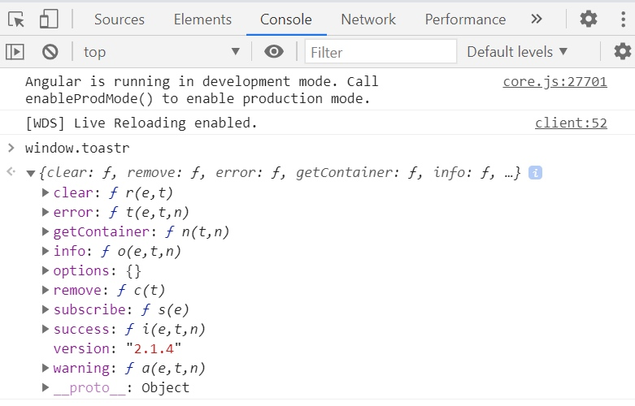
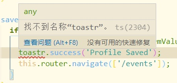

# Angular 中的 DI

我们都知道创建一个服务，并通过 `@Injectable` 装饰器或者在 Module 中的 providers 中注册，并在组件的构造方法中通过如下方式依赖注入：

```typescript
import { AuthService } from '../user/auth.service';
export class NavBarComponent {
    constructor(public auth:AuthService){
    }
}
```

首先，必须先从其文件中导入 AuthService，并在构造函数中以参数的形式将其注入，参数的类型与文件内导出的 Class 一致，这个 Class 是 ES6 的语法糖，它实际上就是一个构造函数。 

但是我们在这里是想得到一个 AuthService 的实例，我们并是想要得到 AuthService Class 或者 AuthService 函数，这就是 Angular 所做的：创建了一个实例并给我们这个实例。当我们注册了 AuthService Class，Angular 会创建这个 Class 的实例，并在任何引用它的构造函数中给我们这个实例，而创建这个实例就发生在我们将 AuthService 注册在 Module 的 providers 中。

那 Angular 是如何知道我们想要的是 AuthService 而不是其他 service 呢？

## Angular 如何知道我们要的是哪个 service 的实例呢？

Angular 通过截获组件构造函数中的声明，通过 TypeScript 的类型声明（这里就是 AuthService），在服务中寻找。所以实际上，它是通过 Class 作为一个 key 来寻找正确的对象，在上面的例子中，AuthService 实例就是在 AuthService 的 DI 注册时被创建的。

### Angular 与 Angular Js 的 DI 的区别

```javascript
angular.module('app').service('auth',AuthService)
```

在 Angular Js 中，服务是通过上面的方式注册的，service() 方法有两个参数，第一个参数是一个字符串，第二个参数是我们想要的对象。所以 Angular Js 的依赖注入是通过字符串来匹配的。

当我们想要这个服务的实例时，我们需要创建一个同名的参数。而在我们编写代码时，常常因为单纯 miss 导致服务注入的失败，不得不在检查我们的代码。

而 Angular 中，我们使用 Class 或者 Type 作为我们的 key 或者换个词 token。

在 Angular 中，构造函数参数的类型 AuthService 起到两个作用：其一是用来给 TypeScript 识别变量类型，让我们在编写代码时 IDE 可以通过 . 来访问其中的成员。其二就是就是 Angular 通过这个 Type 声明在依赖注入注册中寻找匹配的对象。

所以在 Angular 中，我们创建一个 service 就直接创建一个 Class。

## 如何使用 InjectionToken

我们通过使用一个消息通知库来学习如何使用 InjectionToken。

### 如何在 Angular 中使用 toastr

[toastr](https://www.npmjs.com/package/toastr) 是一个通知 Jquery 库，目前已经有支持 Angular 版本的 [ngx-toastr](https://www.npmjs.com/package/ngx-toastr) 提供使用，但是如果想使用原生的 toastr 我们该如何做呢。

根据官方的方法安装 toastr 库到我们的工程中，那如何在 Angular 中使用呢？

首先在 Angular 的 webpack 文件中导入 toastr 的 style 和 script：

```json
"styles": [
    "node_modules/toastr/build/toastr.min.css",
    "src/styles.css"
],
"scripts": [
    "node_modules/jquery/dist/jquery.min.js",
    "node_modules/toastr/build/toastr.min.js"
]
```

此时编译后的 SPA 中已经有了我们需要的 toastr 对象，我们可以在页面的控制台中查看 window.toastr 对象：



但是这时候在使用 toastr 对象时，IDE 会报错：



原因很简单，是因为 TypeScript 并不知道我们的 toastr 对象，这时候需要声明一下这个对象：

```typescript
declare let toastr: any;
```

这时候就可以顺利使用 toastr 库中的成员方法来弹出我们的消息提示框了。

### 添加 toastr 服务

在一个工程中，我们肯定会不止一次的进行 HTTP 请求或者其他一些需要弹出消息提示框的情况，但每次都需要声明一个 toastr 对象有点太麻烦了，我们可以创建下面这个类注册为我们的服务：

```typescript
import { Injectable } from '@angular/core';

declare let toastr: any;

@Injectable()
export class ToastrService {
    success(message: string, title?: string) {
        toastr.success(message, title);
    }
    info(message: string, title?: string) {
        toastr.info(message, title);
    }
    warning(message: string, title?: string) {
        toastr.warning(message, title);
    }
    error(message: string, title?: string) {
        toastr.error(message, title);
    }
}
```

这样我们也能过滤掉 toastr 中其他不必要的成员方法，方便项目中的同事使用。

### InjectionToken 注册服务

回顾一下上文中 Angular 的服务：

> 我们创建一个 service 就直接创建一个 Class

我们并没有创建一个可导出 toastr Class，并没有去用它作为 key 在我们的 Module 中注册它，我们不能在 Module 中导入 toastr，并将其添加到 providers 数组中。

因此我们如下修改我们的 toastr.service.ts：

```typescript
import { InjectionToken } from "@angular/core";

export let TOASTR_TOKEN = new InjectionToken<Toastr>('toastr');

export interface Toastr {
    success(msg: string, title?: string): void;
    info(msg: string, title?: string): void;
    warning(msg: string, title?: string): void;
    error(msg: string, title?: string): void;
}
```

使用 InjectionToken 构造函数 new 一个 TOASTR_TOKEN 对象，并指定其接口构造。这样就创建了我们的 InjectionToken。

然后在我们的 Module 中注册 toastr 服务：

```typescript
import { IToastr, TOASTR_TOKEN } from './common/toastr.service';

declare let toastr: IToastr;

@NgModule({
  ...
  providers: [
    { provide: TOASTR_TOKEN, useValue: toastr }
  ]
  ...
})
```

首先导入我们的 IToastr 接口和 TOASTR_TOKEN InjectionToken，声明 toastr 对象，在 providers 数组中注册，这里注册时没有像之前的 AuthService 服务，只使用了类型。AuthService 的注册其实只是 `{ provide: AuthService , useClass: AuthService }` 的简写（关于 useClass 和 userValue 后面再详细对比）。provide 的值就是 token，而 useValue 的值就是 Angular 为我们创建的实例。

### 注入 InjectionToken 服务

接下来我们看看 InjectionToken 注册的服务如何使用。

```typescript
import { Component, OnInit, Inject } from '@angular/core';
import { IToastr, TOASTR_TOKEN } from '../common/toastr.service';
constructor(
  private auth: AuthService,
  private router: Router,
  @Inject(TOASTR_TOKEN) private toastr: IToastr) {
}
```

除了导入我们的接口 IToastr 和 TOASTR_TOKEN Token 之外，还需要从 `@angular/core` 中导入 Inject。

```typescript
/**
 * Type of the Inject metadata.
 *
 * @publicApi
 */
export declare interface Inject {
    /**
     * A [DI token](guide/glossary#di-token) that maps to the dependency to be injected.
     */
    token: any;
}
```

我们可以看到 Inject 的参数是 token，当我们注入参数 toastr 时，IToastr 并不是我们依赖注入的 Token，而只是用来智能感知。真正指定了 Token 的是装饰器 @Inject()。

这样我就可以在我们的类中拿到 toastr 实例，像普通的 service 一样使用它：

```typescript
  saveProfile(profileFormValue) {
    if (this.profileForm.valid) {
      this.auth.updateUser(profileFormValue.firstName, profileFormValue.lastName);
      this.toastr.success('Profile Saved');
      this.router.navigate(['/events']);
    }
  }
```

## 四种 Provider

上面我们已经见过两种 provider，useValue 和 useClass。

在 Angular 的 DI 中一共有四种 provider：

- [ValueProvider](https://angular.io/api/core/ValueProvider)
- [ClassProvider](https://angular.io/api/core/ClassProvider)
- [ExistingProvider](https://angular.io/api/core/ExistingProvider)
- [FactoryProvider](https://angular.io/api/core/FactoryProvider)

它们分别使用四种方式为 Token 提供一个实例。

## 总结

Angular 是在注册时产生的实例，这样产生的实例将在注册所在作用域内存在。

Angular 依赖注入时是通过 Token 来查找实例。

常用的服务注入实际上是使用 ClassProvider 提供的实例，而其 Token 就是它的 Class，在依赖注入时，Angular 截获其 Class 并以它为 Token 寻找实例。

相信我们都明了依赖注入的设计模式，也明确它的优势。可是在我们之前从 AngularJs 开始到 Angular 板砖的路程中没有过仔细学习 Angular 依赖注入的本质。这让我们在开发中只会复制粘贴代码，导致报错时让我们无从下手时，只能通过查阅文档的案例，来对比自己的代码中具体有哪些错误。但是当知道原理后，我们不但能清晰的写出依赖注入的代码，还可以灵活选用不同的 Provider，写出更漂亮的代码。